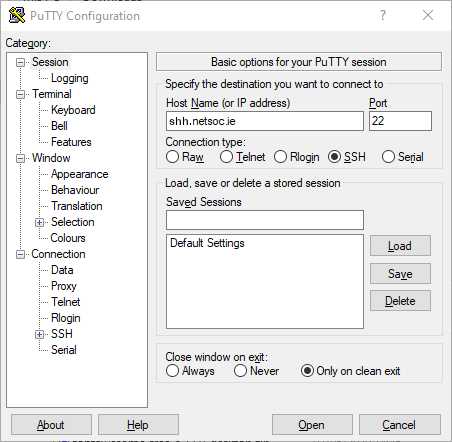
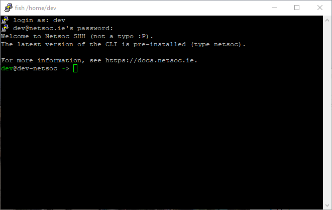

# SSH gateway

SHH (as opposed to SSH) is Netsoc's SSH gateway. This grants you access to a
temporary shell with the latest version of [the CLI](../cli/) pre-installed!
The CLI is pre-configured, so you won't even need to log in!

## Usage

To connect to the gateway, simply SSH with your Netsoc username to `shh.netsoc.ie`.

=== "Linux / macOS"
    Run `ssh myusername@shh.netsoc.ie`:

    ```
    $ ssh dev@shh.netsoc.ie
    Welcome to Netsoc SHH (not a typo :P).
    The latest version of the CLI is pre-installed (type netsoc).

    For more information, see https://docs.netsoc.ie.
    dev@dev-netsoc ~>
    ```

=== "Windows"
    Download
    [PuTTY](https://www.chiark.greenend.org.uk/~sgtatham/putty/latest.html).
    (Latest `.exe` for 64-bit Windows
    [here](https://the.earth.li/~sgtatham/putty/latest/w64/putty.exe)).

    Enter `netsoc.ie` as below:

    

    When prompted, enter your Netsoc username and password:

    

Once connected, simply use `netsoc` as you would on your own machine (no need to
run `netsoc account login`, it's already set up).

!!! warning
    The SHH shell is _temporary_. This means that any files in the environment
    will be **deleted** on disconnect. Please use your [webspace][webspaced]
    for file storage!

## Direct webspace login

If you've set up your [webspace][webspaced], you can log directly into it via
the SSH gateway. Simply change your username in the SSH command to
`<username>-ws`. For example, if your username was `myuser`, use `myuser-ws` to
be dropped straight into a shell in your webspace.

```
$ ssh dev-ws@shh.netsoc.ie
dev-ws@shh.netsoc.ie's password:
root@ws-u3:~#
```

!!! note
    This is not technically a replacement for true SSH in your webspace. You
    won't be able to transfer files via `scp` or an SFTP client this way. For
    information on how to set up SSH in your webspace with port forwarding, see
    [the guide](../webspaced/guides/port_forwarding/).

## Public key authentication

To avoid having to type in your password every time you log in to SHH, you can
set up public key authentication. Generate a private key and configuring it is
out of scope of this document, but once you have your public key, run the
following command:

```
netsoc account set sshkey "my-ssh-pubkey"
```

Once done, you should no longer be prompted for a password when logging into
SHH.

[webspaced]: ../webspaced/
